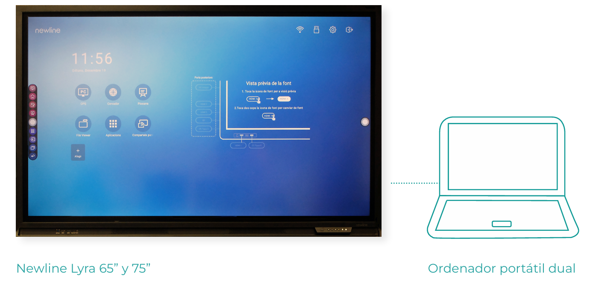
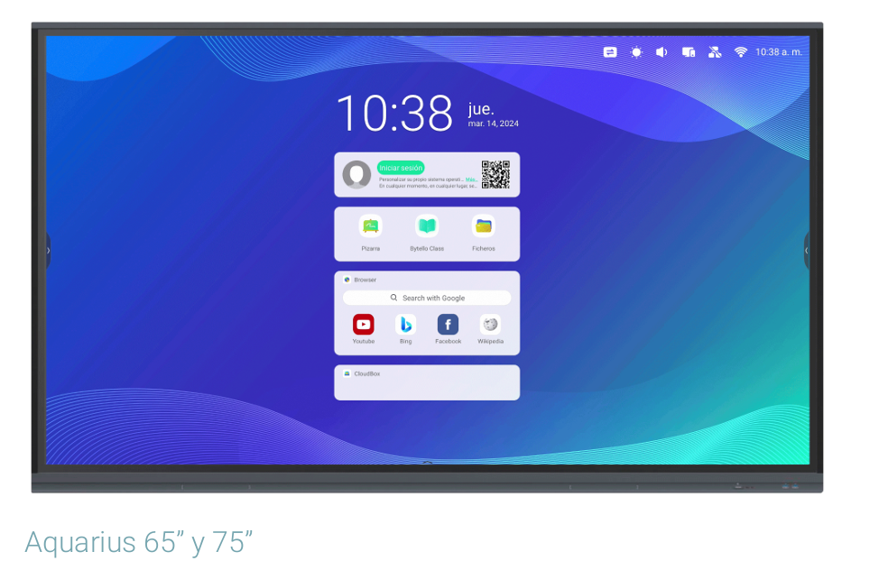
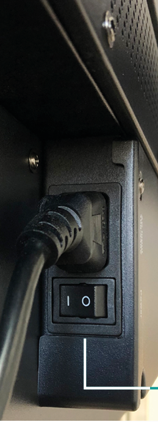
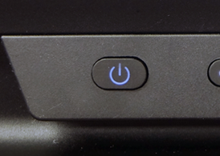

--- 
title: Panel digital interactivo
summary: Conoce las carácterísticas técnicas básicas de la panel digital interactivo.
authors:
    - Manuela Iborra
    - Jose Robledano
date: 2024-09-01
---
# **Panel Digital Interactivo**

Forma parte del **Aula Digital Interactiva** promovida por la **Conselleria**. Esta infraestructura está considerada como una herramienta pedagógica para mejorar.

Se trata de un dispositivo de **visualización** que permite interactuar a través de toques en el panel.

Actualmente se han distribuido dos modelos de panel interactivo digital:

- **Newline**.
  

- **Synetech**.

La funcionalidad de ambos modelos es similar, sin embargo hay diferencias en la apariencia física.

Entre otras características, utiliza el sistema operativo Android 11, de tamaño 65" para primaria 75" para secundaria y una resolución 4K UHD.

!!! info "Sitio web informativo"

    En siguiente enlace se puede consultar la información completa que ofrece la Consellería, para conocer el Aula Digital Interactiva.

    [Web ADI](https://portal.edu.gva.es/pladigital/es/adi_cas/){:target="_blank"}

Algunas de las funciones que aparecen en el manual, son propias del usuario administrador (supervisadas por la coordinación TIC del centro), y dependerán de la estrategia que se siga en cada centro para la gestión del panel digital interactivo.

## **Puesta en marcha**

Antes de poder utilizar el panel digital interactivo es necesario verificar que funciona correctamente. 

Aunque puede parecer una acción obvia, el primer paso es asegurar que está encendida:

- Verifica que está conectada a la corriente.
  
- Verifica que está encendido el interruptor.
  
- Comprueba que se enciende al pulsar el **botón de encendido**.

!!! alert "Interruptor encendido"

    Hay que distinguir entre el **botón** y el **interruptor** de encendido.

    El botón suele estar en la parte frontal, y muestra una iluminación cuando el panel digital interactivo esta en standby.

    El **interruptor**, tiene dos posiciones, suele estar más escondido. Aunque en la documentación indica que está en el lateral derecho, según la versión puede estar en la parte inferior. Eso sí, nunca es visible desde el frente de la pantalla.

**Interruptor encendido**:

**Botón encendido**:

Conocer bien el dispositivo físicamente, nos ayuda a conseguir seguridad para su uso. Ante cualquier incidente debemos ser capaces de realizar acciones de comprobación básicas que nos permitan, solventar el problema o conseguir soluciones alternativas para alcanzar nuestro propósito.

!!! info "Guia rápida"

    Puedes consultar la guía rápida de tu pantalla para conocer detalles, o localizar elementos que te faciliten su uso.

    [Modelo Newline](https://portal.edu.gva.es/pladigital/wp-content/uploads/sites/1192/2023/05/Guia-rapida-ADI-cas.pdf){:target="_blank"}

    [Modelo Synetech](https://portal.edu.gva.es/pladigital/wp-content/uploads/sites/1192/2024/06/Guia-rapida-ADI-23-24-Synetech_cas.pdf){:target="_blank"}

## **Puertos y conexiones**

Son la segunda pieza clave para utilizar correctamente la pantalla digital.

La gran diversidad de puertos permite realizar diferentes usos de los recursos. Se pueden conectar periféricos como por ejemplo: teclado, cámera, mouse o PC, entre otros.

!!! info "Puertos en uso"

    Los puertos en uso, aparecen iluminados o con un punto verde en la pantalla de inicio, de manera que es posible seleccionar el puerto para activar la entrada.

El panel digital interactivo cuenta con puertos para conexión a internet por cable o de manera inalámbrica.

Se puede configurar la conexión WiFi como **punto de acceso** para dar servicio de Internet en el aula a otros dispositivos.

### **Puertos generales**

Se dispone de varios puertos USB para conectar periféricos de tipo general, como pueden ser: cámaras, teclado, mouse, memorias o discos duros externos.

!!! info "Tipos de puertos USB"

    Recuerda que los puertos **USB versión 3.0** son de color azul. Los puertos USB de versiones anteriores son de color negro.

    Algunos dispositivos requieren utilizar una version específica de puerto USB, para su correcto funcionamiento.

    Los puertos **USB tipo C** son más pequeños. Este tipo de puerto es multifunción y pueden conectarse muchos dispositivos o adaptadores diferentes.

Los puertos **HDMI** permiten conectar una fuente externa, como un ordenador. A través de esta conexión se transmite la imagen y el sonido al panel digital interactivo.

Si se quiere utilizar el panel digital interactivo para controlar la fuente conectada, es necesario utilizar la conexion del puerto **USB Touch**, para que los toques sobre el panel digital interactivo tengan efecto sobre la fuente. 

Si no se realiza la conexión, el control se tiene que realizar desde el dispositivo utilizado como fuente.

!!! info "Puertos HDMI"

    Hay que tener en cuenta que hay puertos HDMI de salida y de entrada. Es necesario distinguir e identificar el puerto adecuado para nuestro propósito.

    Por ejemplo, si queremos visualizar el panel digital interactivo, en otro dispositivo de visualización de manera simultanea, se debe utilizar el puerto **HDMI Out**.

    Si al contrario, la intención es mostrar en el panel digital interactivo la imagen generada en otro dispositivo, la conexión se realizará en un puerto **HDMI In** (o simplmente HDMI).

Finalmente también es posible conectar altavoces o micrófonos, a los puertos correspondientes de salida o de entrada de audio.

!!! alert "Puertos combinados"

    Los puertos **HDMI** y **USB Touch** están vinculados, de manera que para que funcionen correctamente en combinación es necesario utilizar *la pareja de puertos con la misma numeración*.

El aula digital interactiva se compone de un portátil (aunque puede haber sido substituido por otro dispositivo con función similar) que está conectado mediante un puerto **HDMI** y **Touch USB combinados**. 

Dispone de arranque dual, lo que permite trabajar desde un sistema *Windows* o desde *Lliurex*.

## **Acceso**

Utiliza el usuario y sus credenciales correspondientes para desbloquear el panel digital interactivo.

Es posible que no todas las opciones de configuración estén disponibles para todos los usuarios. Por eso, hay detalles que pueden varias de un dispositivo a otro, e incluso en el mismo dispositivo según el usuario utilizado.

Las **aplicaciones preinstaladas** pueden variar de un dispositivo a otro. Las más relevantes son:

- Navegador web.
- Visor de imágenes.
- Visor de documentos pdf. Interesante pero puede encontrarse en diferentes circunstancias, como por ejemplo: una versión prueba limitada que muestra información comercial, visor con opciones insuficientes para nuestro propósito.
- Aplicaciones ofimáticas **libre office** o **Microsoft 365**, no es recomendable su instalación ni uso, ya que los recursos son limitados. Si se necesita visualizar algún documento en estos formatos, hay alternativas para poder hacerlo, utilizando Microsoft 365 de manera on line o conectado una fuente externa que disponga de este tipo de aplicación.

En general es conveniente elegir la fuente adecuada al tipo de documento con el que se quiera trabajar. Una opción más versatil es utilizar la fuente HDMI y mostrar el *portátil* u otro ordenador disponible.

!!! alert "Interacción con HDMI"

    Recuerda que conectando el puerto USB-Touch es posible controlar el ordenador o portátil con el panel digital interactivo.

## **Apagado**

Hay diferentes opciones. Se puede **cerrar sesión** (icono puertecita). Pedirá confirmación para cerrar la sesión.

Desde este punto se puede apagar de dos maneras:

1. En la botonera frontal manteniendo pulsado el **botón de encendido**
   
2. Pulsando el icono de apagado que aparece en el panel digital interactivo.

Hay que confirmar la acción a realizar en la venta de aviso que aparece.

También es posible configurar tanto el encendido automático como el apagado automático. Desde la configuracion se pueden activar estas opciones, y programar días y horas para que se realicen. 

Esta funcionalidad puede ser interesante para evitar que quede encendido una vez ha finalizado la jornada.

## **Referencias**

[Web ADI](https://portal.edu.gva.es/pladigital/es/adi_cas/){:target="_blank"}

Dos vídeos donde un compañero nos ahorra la lectura del propósito de ADI [Video 1](https://gvaedu.sharepoint.com/sites/DOCUMENTAR-FormacioTIC/_layouts/15/stream.aspx?id=%2Fsites%2FDOCUMENTAR-FormacioTIC%2FDocumentos%20compartidos%2FGeneral%2FADI%2F03%20VIDEOS%20PANTALLAS%2F01%20Vid%20ADI%2022-23%20Newline%2FVideo%20A_01%20-%20Inicio%201%2Emp4&referrer=StreamWebApp%2EWeb&referrerScenario=AddressBarCopied%2Eview%2E85ed5d9e-32b1-41eb-a5ad-cf54d5dad2be){:target="_blank"} [Video 2](https://gvaedu.sharepoint.com/sites/DOCUMENTAR-FormacioTIC/_layouts/15/stream.aspx?id=%2Fsites%2FDOCUMENTAR-FormacioTIC%2FDocumentos%20compartidos%2FGeneral%2FADI%2F03%20VIDEOS%20PANTALLAS%2F01%20Vid%20ADI%2022-23%20Newline%2FVideo%20A_02%20-%20Inicio%202%2Emp4&referrer=StreamWebApp%2EWeb&referrerScenario=AddressBarCopied%2Eview%2Eb43c9cca-e11a-4cfe-931e-36ec2cd6144f){:target="_blank"}

Repositorio de vídeos sobre acciones con el panel digital interactivo [repositorio](https://gvaedu.sharepoint.com/sites/DOCUMENTAR-FormacioTIC/Documentos%20compartidos/Forms/Grande.aspx?ga=1&id=%2Fsites%2FDOCUMENTAR-FormacioTIC%2FDocumentos%20compartidos%2FGeneral%2FADI%2F03%20VIDEOS%20PANTALLAS%2F01%20Vid%20ADI%2022-23%20Newline&viewid=6c4c1b5a-c52a-4694-86b2-2e0ea9f17998){:target="_blank"}